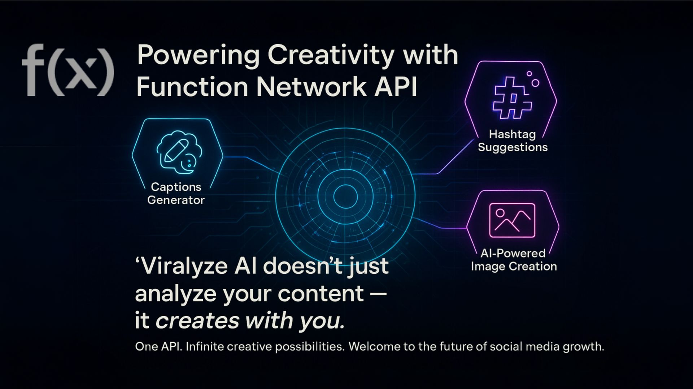
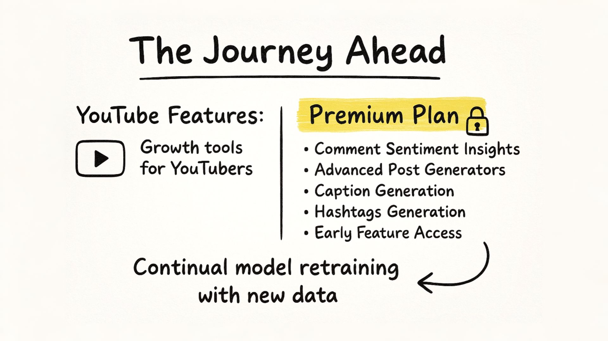
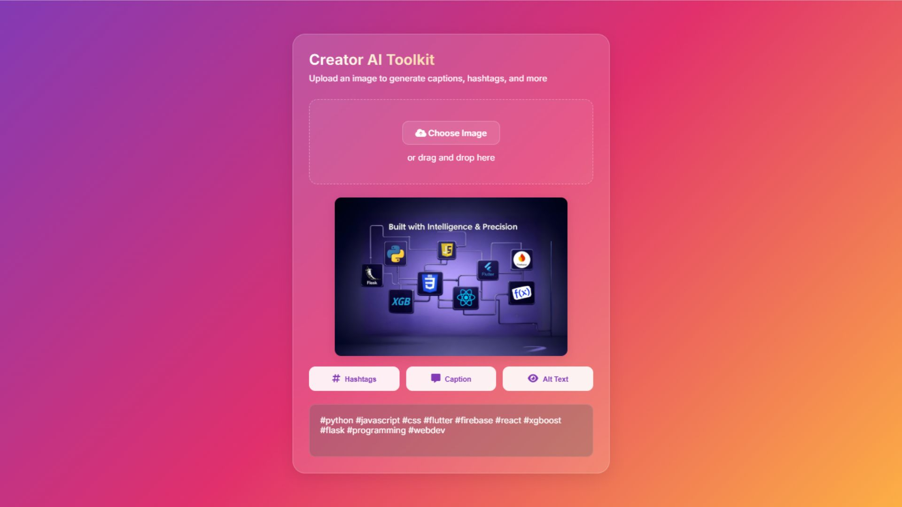

- [x] Create Firebase database
- [x] Check Firebase database
- [ ] Finish Firebase database
- [x] Create AWS S3 store
- [x] Check AWS S3 store
- [ ] Finish AWS S3 store
- [x] Create API
- [x] Check API
- [ ] Finish API
- [ ] Create API routes
- [ ] Check API routes
- [ ] Finish API routes
- [x] Create folder structure
- [x] Check folder structure
- [ ] Finish folder structure
- [ ] Create scraping
- [ ] Check scraping
- [ ] Finish scraping
- [ ] Create deployment
- [ ] Check deployment
- [ ] Finish deployment








### User data model

```json
"user_data" : [{
    "username":"elonmusk",
    "full_name":"Elon Musk",
    "user_id":"123456789",
    "biography":"CEO of SpaceX and Tesla, Inc.",
    "fbid":"1234567890",
    "fb_account_url":"https://www.facebook.com/elonmusk",
    "json_url":"https://s3.amazonaws.com/your-bucket/profiles/elonmusk.json",
    "post_json_url":"https://s3.amazonaws.com/your-bucket/posts/elonmusk.json",
    "profile_pic_url":"https://s3.amazonaws.com/your-bucket/profiles/elonmusk.jpg",
    "profile_pic_url_hd":"https://s3.amazonaws.com/your-bucket/profiles/elonmusk_hd.jpg",
    "is_verified":"True",
    "last_scraped":"2025-04-04T15:00:00Z",
    "followers":231000000,
    "following":1,
    "posts_scraped":1342,
    "posts_count":3192,
    "avg_likes":1.3e6,
    "avg_comments":12_300
}]
```
